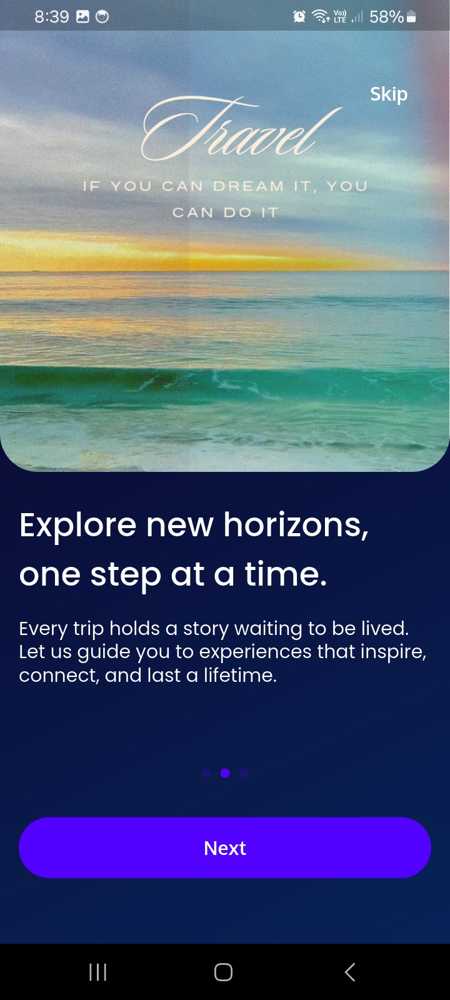
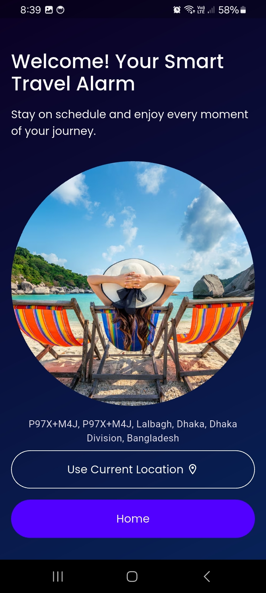
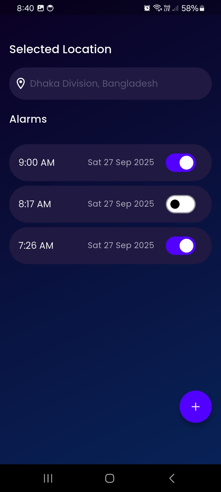

# TravelAlarm

This is a Flutter mobile app for Travellers. The app guides users through onboarding screens, requests location permission, and allows them to set alarms with notifications.

## Features

- **Onboarding Screens**:
    - Three onboarding screens introducing app features using `Smooth Page Indicator`
    - Skip button to skip onboarding

- **Location Access**:
    - Requests user's location permission
    - Displays the selected location on the screen using `geocoding`

- **Alarm Functionality**:
    - Set alarms using a date and time picker
    - View a list of scheduled alarms

- **Notifications**:
    - Alarm notifications using `flutter_local_notifications`

- **Local Storage**:
    - Store alarms locally using Hive

## Packages/Tools Used

- [GetX](https://pub.dev/packages/get) – State management
- [Google Fonts](https://pub.dev/packages/google_fonts) – Custom fonts
- [Smooth Page Indicator](https://pub.dev/packages/smooth_page_indicator) – Onboarding page indicators
- [Video Player](https://pub.dev/packages/video_player) – Play videos in onboarding
- [Geolocator](https://pub.dev/packages/geolocator) – Fetch user location
- [Permission Handler](https://pub.dev/packages/permission_handler) – Handle permissions
- [Geocoding](https://pub.dev/packages/geocoding) – Convert coordinates to address
- [Hive](https://pub.dev/packages/hive) & [Hive Flutter](https://pub.dev/packages/hive_flutter) – Local database
- [Flutter Local Notifications](https://pub.dev/packages/flutter_local_notifications) – Alarm notifications
- [Path Provider](https://pub.dev/packages/path_provider) – File storage path
- [Intl](https://pub.dev/packages/intl) – Date & time formatting
- [UUID](https://pub.dev/packages/uuid) – Unique IDs for alarms

## Screenshots

## App Screenshots

| Onboarding 1 | Onboarding 2 | Onboarding 3 |
| :---: | :---: | :---: |
|  |  |  |
| **Location Setup** | **Alarm List** | |
|  |  |  |

## **Demo Video**
You can watch the PoseGuard demo video here:

- [Demo Video on Loom](https://www.loom.com/share/c71e08b48d2842ac894249ab6d2f167f?sid=b6655472-1ac2-4e84-9380-07d9c1917d9b)
